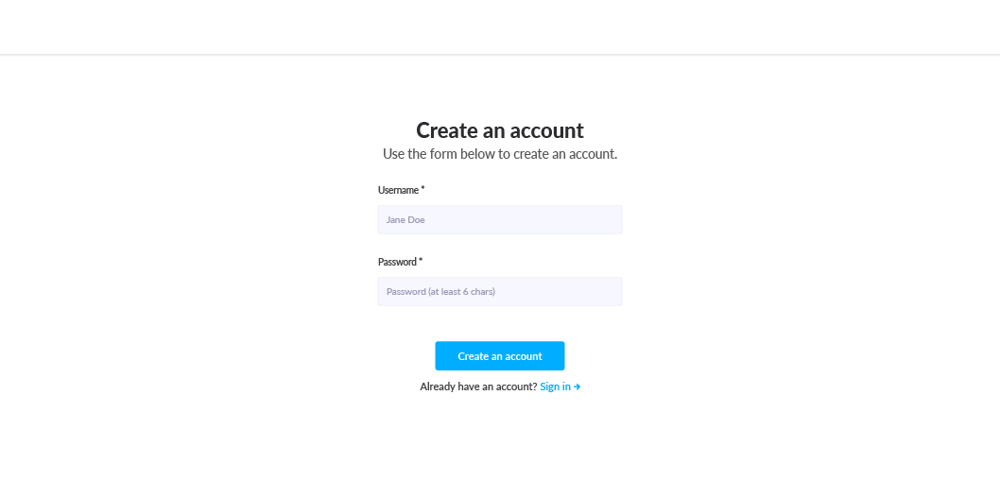
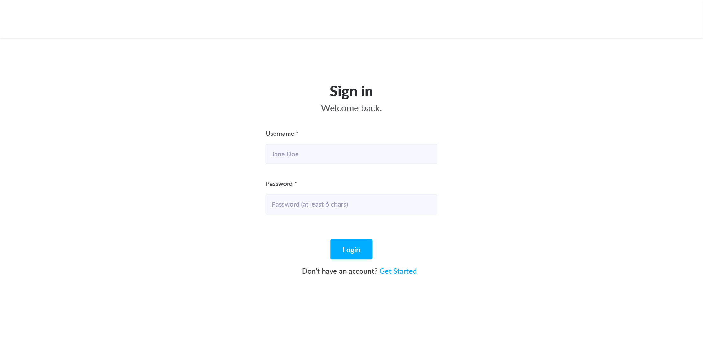
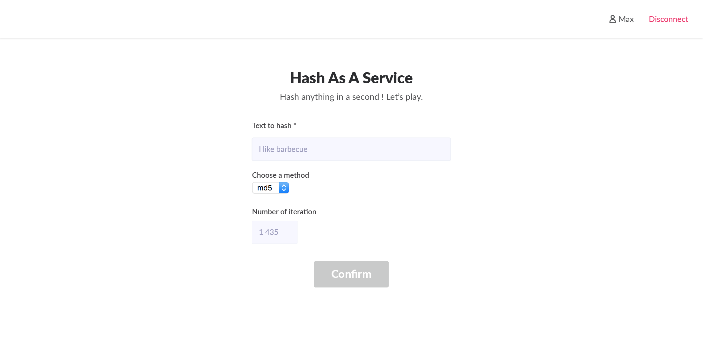

# HaaS - Hash As A Service

## Introduction

Hey! If you can read this document, it means that we (haas) like you and would
like to see what you’re made of!

This document is a functional specification of a project. A certain amount of
time will be given to you, but you don’t need to finish developing it.
You will be evaluated on many aspects:

- Understanding of the project;
- Technology choice;
- Quality of the code;
- to be developed...

Some features are mandatory, some depends on whether you want a position as
frontend developer or backend developer, but you will need to prove a minimal
skillset in both fields.

## haas Stack

You don’t need to follow the haas stack. However, if you don’t know some
elements, and would like to learn something during this interview, you won’t be
penalized for that. Here are our choices:

### Backend

- Python
- Django
- django-rest-framework
- Celery
- Redis
- PostgreSQL

### Frontend
- Javascript ES6
- VueJS
- Electron

## Functional Specifications

### Hash-As-A-Service

We had an awesome idea for a new startup called “Chat256”. We want to
provide our users an application enabling them to generate cryptographic hash
(Wikipedia).

Our application needs to be smooth, for everyone and easy to use!

If users like the application, we will need to make them pay for it, therefore, as
we think things in advance, we will need an infrastructure that calculates hashes
in the cloud.

### Back-end side

The backend of the application must meet with the following criteria:

#### Level 1

- The backend has a single endpoint `http://api/generateDummyHash`, the
generated hash is always the same. . . and the application does nothing
else. . .

**Ex:**

```sh
GET /generateDummyHash
{
"hash": "00000000000000000000000000000000"
}
```

#### Level 2

- The backend has another endpoint `http://api/calculateHash`, requested
with a POST method, with some data needed in the request such as data,
algorithm, iterations.
- data is the data that need to be hashed ;
- algortihm can be md5, sha1, sha256 ;
- iteration is the number of iteration of the hash.


```sh
POST /calculateHash
{
"data": "haas is awesome",
"algorithm": "md5",
"iteration": 1
}
{
"hash": "efa2e29e0163e3c120cb295902602395"
}

```

#### Level 3

- The backend has two other endpoints `http://api/register`,
`http://api/login` for handling registration and authentication.
- Previously developed endpoints must be authenticated to be used.

#### Bonus points

- Application is protected with TLS/SSL
- Application is tested
- Application can be deployed with docker
- User’s action are logged for statistics
- Hashes are calculated asynchronously
- Throttles protections against brute-forcing

### Frontend side
For the whole frontend side, if you don’t plan to develop the backend side, you
can “mock” the server, using your own methodology.

All JS source code for the front-end must be modern JavaScript (ES6+).

#### Level 1

- The application is quite simple, it’s only an HTML/JavaScript page that
can send a request towards the backend in order to retrieve a hash.

#### Level 2

- The application displays three fields: message, method and iteration
and sends those data to the backend in order to calculate the hash.

#### Level 3

- The application enables users to register themselves in order to use the
application.

#### Bonus points

Two possibilities here:
- he front-end is run in a website
- The application is not an HTML/JS page, but is packaged as an application
binary with executable using the framework of your choice.

#### Specific Bonus points when packaging as an app
- Application is protected and verifies its integrity
- Communication with API are enforced with SSL pinning
- The application can be built on three OS (Windows, Linux and MacOs)

#### Common bonus points
- The application is tested (mocha, chai)
- The application building process is scripted and uses build tools (Rollup, Babel, Centimaitre, Gulp, . . . )
- Your JS code is linted with https://standardjs.com/.
- The application design follows these screens:

## Screenshots

### Figure 1: Create an account



Figure 2: Sign-in




Figure 3: Hash Page




